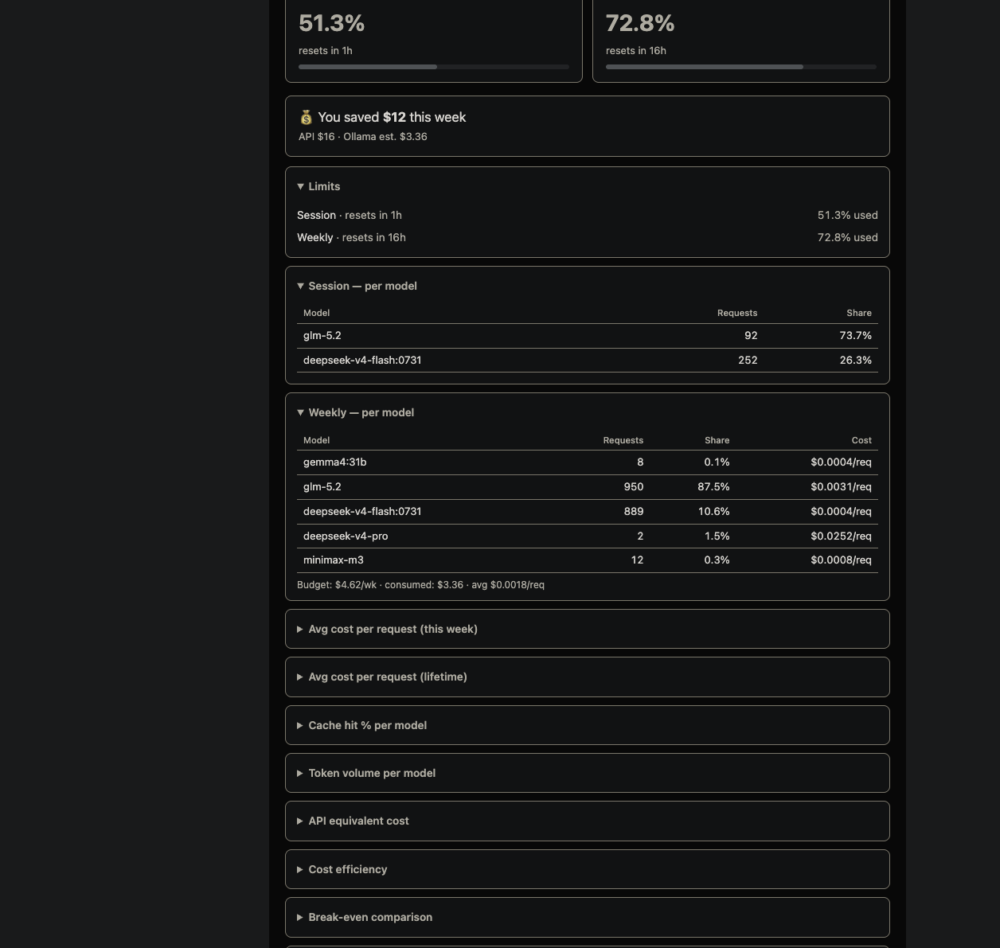

# ollama-cloud-watch

> **⚠️ WORK IN PROGRESS — expect bugs.** This tool is under active development.
> The API client, cookie fallback, watch mode, and reports work, but you may hit
> rough edges. If something breaks, [open an issue](https://github.com/Kosello/ollama-cloud-watch/issues).

Standalone Ollama Cloud usage monitor — a single Python file, zero dependencies (stdlib only). Works on macOS, Linux, and Windows. No Hermes Agent needed.




The script uses Ollama's official `GET /api/usage` endpoint first and falls back
to scraping [ollama.com/settings](https://ollama.com/settings) with a session cookie.

- **Current usage** — observed session/weekly quota %, per-model request counts,
  effective subscription $/request, and estimated API-equivalent $/request + $/1M tokens
- **Watch mode** — continuous polling with history recording and threshold alerts
- **History** — weekly snapshots + 5h session snapshots saved locally (survives Ollama's resets)
- **Alerts** — silent watchdog that fires OS notifications when usage crosses 75% / 90%
- **Report** — full stats MD report with weekly overview + all 5h session detail

## Quick start

```bash
# Download
curl -O https://raw.githubusercontent.com/Kosello/ollama-cloud-watch/main/ollama-cloud-watch.py
chmod +x ollama-cloud-watch.py

# Recommended: export the API key or put it in ~/.ollama-cloud-api-key.txt (mode 600)
export OLLAMA_API_KEY='...'

# Print current usage
python ollama-cloud-watch.py
```

Output:
```
📊 Ollama Cloud — Pro plan
   Session:  19.2% used · est. reset in 4h
   Weekly:   48.7% used · est. reset in 1 day
   Effective subscription: $0.0039/req ($4.60 7-day plan equivalent)

   Session per model:
     glm-5.2                      34 req · 79.6% req share
     deepseek-v4-flash:0731       81 req · 20.4% req share

   Weekly per model:
     glm-5.2                     668 req · 56.2% req share · $0.0080/req · $0.078/1M
     deepseek-v4-flash:0731      504 req · 42.4% req share · $0.0030/req · $0.092/1M
     API price coverage: 100.00% of requests
```

## All modes

```bash
# Print current usage once and exit
python ollama-cloud-watch.py

# Poll every 30 minutes, record history, fire threshold alerts
python ollama-cloud-watch.py --watch

# Poll every 5 minutes
python ollama-cloud-watch.py --watch --interval 300

# Record one history snapshot and exit (good for cron)
python ollama-cloud-watch.py --history

# Silent alert if threshold crossed, else no output (cron watchdog)
python ollama-cloud-watch.py --alert

# Custom thresholds
python ollama-cloud-watch.py --alert --warn 80 --crit 95

# Generate full stats MD report from history
python ollama-cloud-watch.py --report

# Generate and open report in default app
python ollama-cloud-watch.py --report --open

# Raw JSON output (pipe into jq, other tools)
python ollama-cloud-watch.py --json
```

## Dashboard (3 ways)

### 1. Live web dashboard (`--serve`)

Starts a local HTTP server with a self-contained dark-themed dashboard — no dependencies, just Python stdlib.

```bash
python ollama-cloud-watch.py --serve
# → http://localhost:8642/

# Custom port
python ollama-cloud-watch.py --serve --port 8080
```

Shows: session/weekly usage bars with color-coded thresholds, per-model request
mix, effective subscription cost, cache/token estimates, API-equivalent cost,
break-even comparison, weekly history, and 5h session snapshots.

### 2. Static HTML file (`--html`)

Generates a standalone `.html` file from current data — open it in any browser, share it, no server needed.

```bash
python ollama-cloud-watch.py --html          # prints path
python ollama-cloud-watch.py --html --open   # opens in default app
```

### 3. JSON API server (`--api`)

Serves REST endpoints only — for Grafana, custom dashboards, curl/jq, or your own frontend.

```bash
python ollama-cloud-watch.py --api
# → http://localhost:8643/api/usage
```

Endpoints:

| Endpoint | Returns |
|---|---|
| `/api/usage` | Current usage (session/weekly %, resets, per-model, cost estimates) |
| `/api/history` | Weekly history snapshots (all recorded weeks) |
| `/api/sessions` | 5h session snapshots |
| `/api/lifetime` | Lifetime aggregated stats (all weeks, per-model avg cost) |
| `/health` | `{"ok": true}` |

```bash
curl http://localhost:8643/api/usage | jq '.weekly_used_pct'
curl http://localhost:8643/api/lifetime | jq '.est_avg_cost_per_req'
```

All endpoints return JSON with CORS headers (`Access-Control-Allow-Origin: *`), so you can fetch from any frontend.

## Cookie

The script reads your Ollama Cloud session cookie from either:

**macOS Keychain** (recommended on macOS):
```bash
security add-generic-password -s ollama-cloud-watch -a ollama -w '<cookie>' -U
```

**Or a plain file** (works on any OS):
```bash
echo '__Secure-session=<value>' > ~/.ollama-cloud-cookie.txt
chmod 600 ~/.ollama-cloud-cookie.txt
```

Get the cookie from your browser: open [ollama.com/settings](https://ollama.com/settings) (logged in) → DevTools → Application/Storage → Cookies → `https://ollama.com` → copy `__Secure-session`.

Set `OLLAMA_COOKIE_SOURCE=auto|keychain|file` (default: `auto` — Keychain if present, otherwise file).

Use `--cookie /custom/path.txt` for a custom cookie file location.

## Cron setup

```bash
# Watchdog every 30 min — silent unless threshold crossed
*/30 * * * * python /path/to/ollama-cloud-watch.py --alert --cookie ~/.ollama-cloud-cookie.txt

# Daily summary at 9am — records snapshot + prints usage
0 9 * * * python /path/to/ollama-cloud-watch.py --history --cookie ~/.ollama-cloud-cookie.txt

# Weekly report every Monday at 8am
0 8 * * 1 python /path/to/ollama-cloud-watch.py --report
```

## Storage

All files are kept in your home directory, independent of any other tool:

```
~/.ollama-cloud-history.jsonl     # weekly snapshots (one per ISO week, deduped)
~/.ollama-cloud-sessions.jsonl    # 5h session snapshots (one per session window)
~/.ollama-cloud-report.md         # generated report
~/.ollama-cloud-alert-state.json  # threshold state (prevents repeat alerts)
```

## Calculation model

Ollama quota percentage is **not money spent**. The subscription calculation is
only a transparent allocation of the fixed plan fee:

```text
weeks_per_month                = 365.2425 / 12 / 7
7_day_plan_equivalent          = monthly_plan_price / weeks_per_month
effective_subscription_$/req   = 7_day_plan_equivalent / requests_in_quota_window
```

No per-model subscription cost is shown because the usage API exposes request
share, not model quota weights.

### API-equivalent estimate

The API-equivalent estimate combines observed request counts with estimated
tokens/request and public OpenRouter token prices:

```text
API_$/req = uncached_input × input_$/token
          + cached_input   × cache_$/token
          + output         × output_$/token
effective_API_$/1M = API_$/req
                    / (uncached_input + cached_input + output) × 1,000,000
```

Prices and token averages use automatic sources with per-model manual overrides:

| Level | Prices (per 1M tokens) | Tokens per request |
|---|---|---|
| Automatic base | Live OpenRouter data (cached 24h), then builtin gaps | Hermes `state.db` request-weighted model/global averages |
| Manual layer | `~/.ollama-cloud-prices.json` per-model fields | Same file, `tokens_per_request` per model |
| Final fallback | Builtin table | 1000 input + 500 output |

The output shows which source was used (`price_source` / `token_source` in `--json`). To pin prices yourself, create `~/.ollama-cloud-prices.json`:

```json
{
  "models": {
    "glm-5.2": { "input": 0.07, "output": 0.22, "cache_read": 0.013 }
  },
  "tokens_per_request": {
    "glm-5.2": [100000, 3000, 20000]
  }
}
```

Delete the file to revert to automatic. If no cache-read price is published,
cached input uses the regular input price; it is never treated as free.

## Caveats

- The official API does not expose plan tier, reset timestamps, current token
  counts, cache hits, elapsed weekly-period time, or per-model quota weights.
  API reset times are shown as unavailable; token costs are labeled estimates.
- Cookie scraping is fallback-only and remains brittle.
- The cookie is a login token — keep it private (`chmod 600` on the file).
- The script uses only Python stdlib — no pip install needed.

## Hermes Agent integration

If you use [Hermes Agent](https://hermes-agent.nousresearch.com), the integrated
desktop/backend plugin lives at [Kosello/ollama-usage-monitor](https://github.com/Kosello/ollama-usage-monitor).

## License

MIT